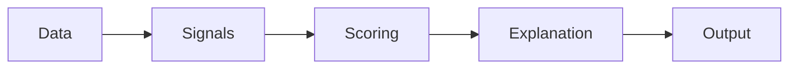

# Stock Insights API

`stock-insights` is an Express + MongoDB API for tracking stock positions and generating portfolio-level decision support. It covers:

- JWT-based authentication
- User-owned stock CRUD
- Portfolio summary and allocation analysis
- Sell-analysis recommendations
- Scenario projections with optional inflation adjustment
- Portfolio insights that combine portfolio signals, scoring, explanations, and rankings

## Quick Start

```bash
npm install
npm run start:ai-news
npm start
```

Main API base URL: `http://localhost:4000/api`

AI sentiment service base URL: `http://localhost:4001`

Run tests:

```bash
npm test
```

Seed demo data:

```bash
npm run seed
```

Demo credentials from the seed script:

- `email`: `demo@stockinsights.dev`
- `password`: `Demo@1234`

## Authentication

Protected endpoints require:

```http
Authorization: Bearer <jwt>
```

Tokens are returned by:

- `POST /api/auth/signup`
- `POST /api/auth/login`

## Response Conventions

Successful responses use:

```json
{
  "success": true,
  "data": {}
}
```

Error responses use:

```json
{
  "success": false,
  "error": {
    "code": "VALIDATION_ERROR",
    "message": "Validation failed",
    "details": [
      {
        "field": "quantity",
        "code": "QUANTITY_INVALID"
      }
    ]
  }
}
```

Common error codes:

- `AUTH_TOKEN_MISSING`
- `AUTH_TOKEN_INVALID`
- `VALIDATION_ERROR`
- `INVALID_CREDENTIALS`
- `EMAIL_ALREADY_IN_USE`
- `STOCK_NOT_FOUND`
- `ROUTE_NOT_FOUND`

## System Flow

Portfolio insights follow this pipeline:



### Data

- User-owned stock positions from MongoDB
- Buy price, buy date, quantity, optional current price override
- Query options such as `years`, `includeInflation`, and `inflationRate`
- Sentiment data from `ai-news-service` or a neutral fallback if the service is unavailable

### Signals

- P/L and P/L %
- Allocation %
- Holding duration and long-term vs short-term classification
- Sell-analysis suggestion codes
- Overexposure severity and penalty
- Scenario ranges for each position and the portfolio

### Scoring

Each insight position gets a `scoring` object built from:

- `technicalScore`
- `fundamentalScore`
- `sentimentScore`
- `portfolioSignals`

These are normalized to a `0-10` scale, weighted, and combined into `finalScore`.

### Explanation

The API generates:

- `confidenceLabel`
- up to 3 human-readable `explanations`
- a portfolio-level summary explanation

### Output

`GET /api/portfolio/insights` returns:

- `portfolioSummary`
- `portfolioScenarioProjection`
- `rankings`
- `positions[]`

## API Reference

The deep-dive below emphasizes the endpoints requested for interview-style documentation:

- Auth: `/api/auth/signup`, `/api/auth/login`
- Stocks: `/api/stocks` CRUD
- Portfolio insights: `/api/portfolio/insights`

For completeness, the repository also exposes:

- `GET /api/health`
- `GET /api/portfolio/summary`
- `POST /api/portfolio/sell-analysis`
- `POST /api/portfolio/scenarios`

---

## Health

### `GET /api/health`

Returns a simple service heartbeat.

| Item | Value |
| --- | --- |
| Method | `GET` |
| Path | `/api/health` |
| Auth required | No |

Sample response:

```json
{
  "success": true,
  "data": {
    "service": "stock-insights",
    "status": "ok"
  }
}
```

---

## Auth

### `POST /api/auth/signup`

Creates a new user, hashes the password, and returns a JWT.

| Item | Value |
| --- | --- |
| Method | `POST` |
| Path | `/api/auth/signup` |
| Auth required | No |

Request headers:

| Header | Required | Value |
| --- | --- | --- |
| `Content-Type` | Yes | `application/json` |

Request body:

| Field | Type | Required | Notes |
| --- | --- | --- | --- |
| `name` | `string` | Yes | Minimum length: 2 |
| `email` | `string` | Yes | Must be a valid email |
| `password` | `string` | Yes | Minimum length: 8 |

Example request body:

```json
{
  "name": "Demo Investor",
  "email": "demo@stockinsights.dev",
  "password": "Demo@1234"
}
```

Sample response:

```json
{
  "success": true,
  "data": {
    "user": {
      "_id": "6804f0f1a1a1a1a1a1a1a001",
      "name": "Demo Investor",
      "email": "demo@stockinsights.dev",
      "createdAt": "2026-04-20T15:40:12.000Z",
      "updatedAt": "2026-04-20T15:40:12.000Z"
    },
    "token": "eyJhbGciOiJIUzI1NiIsInR5cCI6IkpXVCJ9.demo.signup.token"
  }
}
```

Common errors:

- `400 VALIDATION_ERROR`
- `409 EMAIL_ALREADY_IN_USE`

### `POST /api/auth/login`

Authenticates an existing user and returns a fresh JWT.

| Item | Value |
| --- | --- |
| Method | `POST` |
| Path | `/api/auth/login` |
| Auth required | No |

Request headers:

| Header | Required | Value |
| --- | --- | --- |
| `Content-Type` | Yes | `application/json` |

Request body:

| Field | Type | Required | Notes |
| --- | --- | --- | --- |
| `email` | `string` | Yes | Must match a registered account |
| `password` | `string` | Yes | Plain text password |

Example request body:

```json
{
  "email": "demo@stockinsights.dev",
  "password": "Demo@1234"
}
```

Sample response:

```json
{
  "success": true,
  "data": {
    "user": {
      "_id": "6804f0f1a1a1a1a1a1a1a001",
      "name": "Demo Investor",
      "email": "demo@stockinsights.dev",
      "createdAt": "2026-04-20T15:40:12.000Z",
      "updatedAt": "2026-04-20T15:40:12.000Z"
    },
    "token": "eyJhbGciOiJIUzI1NiIsInR5cCI6IkpXVCJ9.demo.login.token"
  }
}
```

Common errors:

- `400 VALIDATION_ERROR`
- `401 INVALID_CREDENTIALS`

---

## Stocks

All stock endpoints require a bearer token.

### `GET /api/stocks`

Returns all positions owned by the authenticated user, sorted by `buyDate` descending and then `createdAt` descending.

| Item | Value |
| --- | --- |
| Method | `GET` |
| Path | `/api/stocks` |
| Auth required | Yes |

Request headers:

| Header | Required | Value |
| --- | --- | --- |
| `Authorization` | Yes | `Bearer <jwt>` |

Query params: none

Sample response:

```json
{
  "success": true,
  "data": [
    {
      "_id": "6804f0f1a1a1a1a1a1a1a103",
      "user": "6804f0f1a1a1a1a1a1a1a001",
      "symbol": "SBIN",
      "quantity": 35,
      "buyPrice": 720,
      "buyDate": "2025-06-08T00:00:00.000Z",
      "currentPrice": 807,
      "note": "Financial exposure",
      "createdAt": "2026-04-20T15:45:18.000Z",
      "updatedAt": "2026-04-20T15:45:18.000Z",
      "__v": 0
    },
    {
      "_id": "6804f0f1a1a1a1a1a1a1a102",
      "user": "6804f0f1a1a1a1a1a1a1a001",
      "symbol": "INFY",
      "quantity": 20,
      "buyPrice": 1480,
      "buyDate": "2025-01-15T00:00:00.000Z",
      "currentPrice": 1624,
      "note": "Accumulated on dip",
      "createdAt": "2026-04-20T15:45:17.000Z",
      "updatedAt": "2026-04-20T15:45:17.000Z",
      "__v": 0
    }
  ]
}
```

Note: this list currently comes from `.lean()`, so `__v` can appear on list items. Single-item create/get/update responses do not include `__v`.

### `POST /api/stocks`

Creates a new stock position for the authenticated user.

| Item | Value |
| --- | --- |
| Method | `POST` |
| Path | `/api/stocks` |
| Auth required | Yes |

Request headers:

| Header | Required | Value |
| --- | --- | --- |
| `Authorization` | Yes | `Bearer <jwt>` |
| `Content-Type` | Yes | `application/json` |

Request body:

| Field | Type | Required | Notes |
| --- | --- | --- | --- |
| `symbol` | `string` | Yes | 1-15 chars, letters with optional `.` or `-`; saved uppercase |
| `quantity` | `number` | Yes | Must be greater than `0` |
| `buyPrice` | `number` | Yes | Must be greater than `0` |
| `buyDate` | `string` | Yes | Any valid date; stored as ISO date |
| `currentPrice` | `number \| null` | No | Optional override; if omitted or `null`, pricing can fall back to mock price logic in portfolio endpoints |
| `note` | `string \| null` | No | Optional free-text note |

Example request body:

```json
{
  "symbol": "TCS",
  "quantity": 12,
  "buyPrice": 3650,
  "buyDate": "2024-02-12",
  "currentPrice": 4015,
  "note": "Core IT holding"
}
```

Sample response:

```json
{
  "success": true,
  "data": {
    "_id": "6804f0f1a1a1a1a1a1a1a101",
    "user": "6804f0f1a1a1a1a1a1a1a001",
    "symbol": "TCS",
    "quantity": 12,
    "buyPrice": 3650,
    "buyDate": "2024-02-12T00:00:00.000Z",
    "currentPrice": 4015,
    "note": "Core IT holding",
    "createdAt": "2026-04-20T15:45:10.000Z",
    "updatedAt": "2026-04-20T15:45:10.000Z"
  }
}
```

Common errors:

- `400 VALIDATION_ERROR`
- `401 AUTH_TOKEN_MISSING`
- `401 AUTH_TOKEN_INVALID`

### `GET /api/stocks/:stockId`

Returns one stock position owned by the authenticated user.

| Item | Value |
| --- | --- |
| Method | `GET` |
| Path | `/api/stocks/:stockId` |
| Auth required | Yes |

Request headers:

| Header | Required | Value |
| --- | --- | --- |
| `Authorization` | Yes | `Bearer <jwt>` |

Path params:

| Param | Type | Required | Description |
| --- | --- | --- | --- |
| `stockId` | `string` | Yes | Mongo ObjectId of the stock position |

Sample response:

```json
{
  "success": true,
  "data": {
    "_id": "6804f0f1a1a1a1a1a1a1a101",
    "user": "6804f0f1a1a1a1a1a1a1a001",
    "symbol": "TCS",
    "quantity": 12,
    "buyPrice": 3650,
    "buyDate": "2024-02-12T00:00:00.000Z",
    "currentPrice": 4015,
    "note": "Core IT holding",
    "createdAt": "2026-04-20T15:45:10.000Z",
    "updatedAt": "2026-04-20T15:45:10.000Z"
  }
}
```

Common errors:

- `401 AUTH_TOKEN_MISSING`
- `401 AUTH_TOKEN_INVALID`
- `404 STOCK_NOT_FOUND`

### `PATCH /api/stocks/:stockId`

Partially updates a stock position owned by the authenticated user.

| Item | Value |
| --- | --- |
| Method | `PATCH` |
| Path | `/api/stocks/:stockId` |
| Auth required | Yes |

Request headers:

| Header | Required | Value |
| --- | --- | --- |
| `Authorization` | Yes | `Bearer <jwt>` |
| `Content-Type` | Yes | `application/json` |

Path params:

| Param | Type | Required | Description |
| --- | --- | --- | --- |
| `stockId` | `string` | Yes | Mongo ObjectId of the stock position |

Request body:

All fields are optional. Validation rules are the same as create.

Example request body:

```json
{
  "quantity": 15,
  "currentPrice": 4055,
  "note": "Increased after earnings"
}
```

Sample response:

```json
{
  "success": true,
  "data": {
    "_id": "6804f0f1a1a1a1a1a1a1a101",
    "user": "6804f0f1a1a1a1a1a1a1a001",
    "symbol": "TCS",
    "quantity": 15,
    "buyPrice": 3650,
    "buyDate": "2024-02-12T00:00:00.000Z",
    "currentPrice": 4055,
    "note": "Increased after earnings",
    "createdAt": "2026-04-20T15:45:10.000Z",
    "updatedAt": "2026-04-20T16:05:44.000Z"
  }
}
```

Common errors:

- `400 VALIDATION_ERROR`
- `401 AUTH_TOKEN_MISSING`
- `401 AUTH_TOKEN_INVALID`
- `404 STOCK_NOT_FOUND`

### `DELETE /api/stocks/:stockId`

Deletes a stock position owned by the authenticated user.

| Item | Value |
| --- | --- |
| Method | `DELETE` |
| Path | `/api/stocks/:stockId` |
| Auth required | Yes |

Request headers:

| Header | Required | Value |
| --- | --- | --- |
| `Authorization` | Yes | `Bearer <jwt>` |

Path params:

| Param | Type | Required | Description |
| --- | --- | --- | --- |
| `stockId` | `string` | Yes | Mongo ObjectId of the stock position |

Sample response:

```json
{
  "success": true,
  "data": {
    "deleted": true,
    "stockId": "6804f0f1a1a1a1a1a1a1a101"
  }
}
```

Common errors:

- `401 AUTH_TOKEN_MISSING`
- `401 AUTH_TOKEN_INVALID`
- `404 STOCK_NOT_FOUND`

---

## Portfolio Summary

### `GET /api/portfolio/summary`

Returns a portfolio summary plus scenario projections and per-position sell/scenario data.

| Item | Value |
| --- | --- |
| Method | `GET` |
| Path | `/api/portfolio/summary` |
| Auth required | Yes |

Request headers:

| Header | Required | Value |
| --- | --- | --- |
| `Authorization` | Yes | `Bearer <jwt>` |

Query params:

| Param | Type | Required | Default | Description |
| --- | --- | --- | --- | --- |
| `years` | `number` | No | `3` | Scenario horizon in years |
| `includeInflation` | `boolean` | No | `false` | Accepts `true`, `"true"`, `1`, or `"1"` |
| `inflationRate` | `number` | No | `6` | Annual inflation percentage; used only when `includeInflation=true` |

Example query:

```http
GET /api/portfolio/summary?years=3&includeInflation=true&inflationRate=6
```

Sample response:

```json
{
  "success": true,
  "data": {
    "options": {
      "years": 3,
      "includeInflation": true,
      "inflationRatePct": 6
    },
    "summary": {
      "totalInvestment": 98600,
      "totalCurrentValue": 108905,
      "totalProfitLoss": 10305,
      "totalProfitLossPct": 10.45,
      "holdingsCount": 3,
      "allocation": [
        {
          "symbol": "TCS",
          "allocationPct": 44.24
        },
        {
          "symbol": "INFY",
          "allocationPct": 29.82
        },
        {
          "symbol": "SBIN",
          "allocationPct": 25.94
        }
      ]
    },
    "portfolioScenarioProjection": {
      "principal": 108905,
      "years": 3,
      "includeInflation": true,
      "inflationRatePct": 6,
      "scenarios": [
        {
          "name": "conservative",
          "annualRatePct": 5,
          "nominalFutureValue": 126071.15,
          "inflationAdjustedFutureValue": 105851.77
        },
        {
          "name": "moderate",
          "annualRatePct": 10,
          "nominalFutureValue": 144952.56,
          "inflationAdjustedFutureValue": 121704.96
        },
        {
          "name": "aggressive",
          "annualRatePct": 15,
          "nominalFutureValue": 165630.89,
          "inflationAdjustedFutureValue": 139066.89
        }
      ],
      "range": {
        "nominalMin": 126071.15,
        "nominalMax": 165630.89,
        "inflationAdjustedMin": 105851.77,
        "inflationAdjustedMax": 139066.89
      }
    },
    "positions": [
      {
        "stockId": "6804f0f1a1a1a1a1a1a1a101",
        "symbol": "TCS",
        "quantity": 12,
        "note": "Core IT holding",
        "prices": {
          "buyPrice": 3650,
          "currentPrice": 4015
        },
        "holding": {
          "buyDate": "2024-02-12T00:00:00.000Z",
          "holdingDays": 798
        },
        "metrics": {
          "investedAmount": 43800,
          "currentValue": 48180,
          "profitLoss": 4380,
          "profitLossPct": 10,
          "allocationPct": 44.24
        },
        "sellAnalysis": {
          "inputs": {
            "buyPrice": 3650,
            "quantity": 12,
            "currentPrice": 4015,
            "holdingDurationDays": 798
          },
          "metrics": {
            "totalInvestment": 43800,
            "currentValue": 48180,
            "profitLoss": 4380,
            "profitLossPct": 10
          },
          "classification": {
            "holdingType": "long_term",
            "thresholdDays": 365
          },
          "suggestion": {
            "code": "hold_for_long_term",
            "reasonCodes": [
              "position_in_profit",
              "long_term_holding",
              "long_term_window_active"
            ]
          },
          "signals": {
            "profitable": true,
            "lossMaking": false
          }
        },
        "scenarioProjection": {
          "principal": 48180,
          "years": 3,
          "includeInflation": true,
          "inflationRatePct": 6,
          "scenarios": [
            {
              "name": "conservative",
              "annualRatePct": 5,
              "nominalFutureValue": 55774.37,
              "inflationAdjustedFutureValue": 46829.24
            },
            {
              "name": "moderate",
              "annualRatePct": 10,
              "nominalFutureValue": 64127.58,
              "inflationAdjustedFutureValue": 53842.75
            },
            {
              "name": "aggressive",
              "annualRatePct": 15,
              "nominalFutureValue": 73275.76,
              "inflationAdjustedFutureValue": 61523.74
            }
          ],
          "range": {
            "nominalMin": 55774.37,
            "nominalMax": 73275.76,
            "inflationAdjustedMin": 46829.24,
            "inflationAdjustedMax": 61523.74
          }
        }
      }
    ]
  }
}
```

---

## Portfolio Insights

### `GET /api/portfolio/insights`

This is the most important endpoint in the project. It turns raw holdings into a decision-support payload with portfolio summary context, rankings, position-by-position scoring, and natural-language explanations.

| Item | Value |
| --- | --- |
| Method | `GET` |
| Path | `/api/portfolio/insights` |
| Auth required | Yes |

Request headers:

| Header | Required | Value |
| --- | --- | --- |
| `Authorization` | Yes | `Bearer <jwt>` |

Query params:

| Param | Type | Required | Default | Description |
| --- | --- | --- | --- | --- |
| `years` | `number` | No | `3` | Scenario horizon in years for portfolio and position projections |
| `includeInflation` | `boolean` | No | `false` | When truthy, adds `inflationAdjustedFutureValue` and real-value ranges |
| `inflationRate` | `number` | No | `6` | Annual inflation percentage if inflation adjustment is enabled |

Example query:

```http
GET /api/portfolio/insights?years=3&includeInflation=true&inflationRate=6
```

Sample response:

The example below is intentionally representative instead of exhaustive. Actual `positions` always includes one entry per stock in the authenticated portfolio, and ranking arrays can contain up to 3 entries each.

```json
{
  "success": true,
  "data": {
    "options": {
      "years": 3,
      "includeInflation": true,
      "inflationRatePct": 6
    },
    "portfolioSummary": {
      "totalInvestment": 174575,
      "totalCurrentValue": 182635,
      "totalProfitLoss": 8060,
      "totalProfitLossPct": 4.62,
      "holdingsCount": 6,
      "allocation": [
        {
          "symbol": "TCS",
          "allocationPct": 40.41
        },
        {
          "symbol": "INFY",
          "allocationPct": 16.43
        },
        {
          "symbol": "SBIN",
          "allocationPct": 15.47
        }
      ],
      "explanation": "Portfolio is up +4.62% (₹8,060) across 6 holdings. Concentration risk is elevated with 1 overexposed position, led by TCS at 40.41%. Scenario-based portfolio outcomes range from ₹1,77,515 to ₹2,33,217 over 3 years (scenario-based)."
    },
    "portfolioScenarioProjection": {
      "principal": 182635,
      "years": 3,
      "includeInflation": true,
      "inflationRatePct": 6,
      "scenarios": [
        {
          "name": "conservative",
          "annualRatePct": 5,
          "nominalFutureValue": 211422.84,
          "inflationAdjustedFutureValue": 177514.69
        },
        {
          "name": "moderate",
          "annualRatePct": 10,
          "nominalFutureValue": 243087.19,
          "inflationAdjustedFutureValue": 204100.69
        },
        {
          "name": "aggressive",
          "annualRatePct": 15,
          "nominalFutureValue": 277765.01,
          "inflationAdjustedFutureValue": 233216.86
        }
      ],
      "range": {
        "nominalMin": 211422.84,
        "nominalMax": 277765.01,
        "inflationAdjustedMin": 177514.69,
        "inflationAdjustedMax": 233216.86
      }
    },
    "rankings": {
      "topPerformers": [
        {
          "stockId": "6804f0f1a1a1a1a1a1a1b101",
          "symbol": "TCS",
          "allocationPct": 40.41,
          "profitLossPct": 12.33,
          "currentValue": 73800,
          "finalScore": 8.34,
          "sentimentLabel": "neutral",
          "suggestionCode": "hold_for_long_term",
          "signalCodes": [
            "moderate_overexposure",
            "strong_unrealized_gain"
          ]
        }
      ],
      "worstPerformers": [
        {
          "stockId": "6804f0f1a1a1a1a1a1a1b106",
          "symbol": "AAPL",
          "allocationPct": 0.54,
          "profitLossPct": -7.91,
          "currentValue": 990,
          "finalScore": 3.13,
          "sentimentLabel": "neutral",
          "suggestionCode": "hold_for_long_term",
          "signalCodes": []
        }
      ],
      "overexposure": [
        {
          "stockId": "6804f0f1a1a1a1a1a1a1b101",
          "symbol": "TCS",
          "allocationPct": 40.41,
          "profitLossPct": 12.33,
          "currentValue": 73800,
          "finalScore": 8.34,
          "sentimentLabel": "neutral",
          "suggestionCode": "hold_for_long_term",
          "signalCodes": [
            "moderate_overexposure",
            "strong_unrealized_gain"
          ],
          "severity": "moderate_overexposure",
          "overexposureSeverity": "moderate_overexposure",
          "overexposurePenalty": -0.04
        }
      ]
    },
    "positions": [
      {
        "stockId": "6804f0f1a1a1a1a1a1a1b101",
        "symbol": "TCS",
        "quantity": 18,
        "prices": {
          "buyPrice": 3650,
          "currentPrice": 4100
        },
        "holding": {
          "buyDate": "2024-02-12T00:00:00.000Z",
          "holdingDays": 798
        },
        "metrics": {
          "investedAmount": 65700,
          "currentValue": 73800,
          "profitLoss": 8100,
          "profitLossPct": 12.33,
          "allocationPct": 40.41
        },
        "confidenceLabel": "strong signal",
        "explanations": [
          "Moderate overexposure is the strongest signal here; this is a strong signal and the 40.41% allocation carries a -0.04 portfolio penalty and adds concentration risk.",
          "The position is long-term and profitable (+12.33%); current sell signal is to hold, and sentiment is neutral.",
          "Inflation-adjusted projected outcomes range from ₹71,731 to ₹94,239 over 3 years (scenario-based)."
        ],
        "sellAnalysis": {
          "inputs": {
            "buyPrice": 3650,
            "quantity": 18,
            "currentPrice": 4100,
            "holdingDurationDays": 798
          },
          "metrics": {
            "totalInvestment": 65700,
            "currentValue": 73800,
            "profitLoss": 8100,
            "profitLossPct": 12.33
          },
          "classification": {
            "holdingType": "long_term",
            "thresholdDays": 365
          },
          "suggestion": {
            "code": "hold_for_long_term",
            "reasonCodes": [
              "position_in_profit",
              "long_term_holding",
              "long_term_window_active"
            ]
          },
          "signals": {
            "profitable": true,
            "lossMaking": false
          }
        },
        "scenarioProjection": {
          "principal": 73800,
          "years": 3,
          "includeInflation": true,
          "inflationRatePct": 6,
          "scenarios": [
            {
              "name": "conservative",
              "annualRatePct": 5,
              "nominalFutureValue": 85432.73,
              "inflationAdjustedFutureValue": 71730.97
            },
            {
              "name": "moderate",
              "annualRatePct": 10,
              "nominalFutureValue": 98227.8,
              "inflationAdjustedFutureValue": 82473.96
            },
            {
              "name": "aggressive",
              "annualRatePct": 15,
              "nominalFutureValue": 112240.57,
              "inflationAdjustedFutureValue": 94239.35
            }
          ],
          "range": {
            "nominalMin": 85432.73,
            "nominalMax": 112240.57,
            "inflationAdjustedMin": 71730.97,
            "inflationAdjustedMax": 94239.35
          }
        },
        "sentiment": {
          "symbol": "TCS",
          "sentiment": {
            "label": "neutral",
            "score": 0
          },
          "aggregate": {
            "headlineCount": 0,
            "totalHeadlineScore": 0,
            "averageHeadlineScore": 0
          },
          "source": {
            "service": "ai-news-service",
            "status": "fallback",
            "reasonCode": "SERVICE_UNAVAILABLE"
          },
          "headlines": []
        },
        "scoring": {
          "technicalScore": 2,
          "fundamentalScore": 3,
          "sentimentScore": 0,
          "portfolioSignals": {
            "score": 1.96,
            "signalCodes": [
              "moderate_overexposure",
              "strong_unrealized_gain"
            ],
            "overexposureSeverity": "moderate_overexposure",
            "overexposurePenalty": -0.04
          },
          "defaultWeights": {
            "technicalScore": 0.35,
            "fundamentalScore": 0.25,
            "sentimentScore": 0.15,
            "portfolioSignals": 0.25
          },
          "weights": {
            "technicalScore": 0.25,
            "fundamentalScore": 0.3,
            "sentimentScore": 0.08,
            "portfolioSignals": 0.37
          },
          "weightAdjustments": [
            "overexposure_emphasis",
            "long_term_fundamental_emphasis"
          ],
          "normalizedScores": {
            "technicalScore": 7.5,
            "fundamentalScore": 10,
            "sentimentScore": 5,
            "portfolioSignals": 8.27
          },
          "weightedScores": {
            "technicalScore": 1.88,
            "fundamentalScore": 3,
            "sentimentScore": 0.4,
            "portfolioSignals": 3.06
          },
          "scoreScale": {
            "min": 0,
            "max": 10
          },
          "finalScore": 8.34
        }
      }
    ]
  }
}
```

### `/api/portfolio/insights` Field Guide

#### `portfolioSummary`

High-level portfolio metrics:

- `totalInvestment`: total buy-side capital across all holdings
- `totalCurrentValue`: total present value using provided `currentPrice` or mock resolved price
- `totalProfitLoss`: `totalCurrentValue - totalInvestment`
- `totalProfitLossPct`: percentage return on the full portfolio
- `holdingsCount`: number of positions
- `allocation[]`: symbol-level allocation percentages
- `explanation`: one generated portfolio-level narrative paragraph

#### `positions[]`

Each array item is a fully analyzed position and contains:

- `prices`: buy price and current price
- `holding`: original buy date plus computed `holdingDays`
- `metrics`: invested amount, current value, P/L, P/L %, and allocation %
- `sellAnalysis`: structured sell recommendation output
- `scenarioProjection`: conservative/moderate/aggressive projection ranges
- `sentiment`: external sentiment payload or neutral fallback
- `scoring`: machine-readable scoring breakdown
- `confidenceLabel`: human summary of the final score
- `explanations`: up to 3 short sentences designed for interview/demo readability

Sentiment shape notes:

- when `ai-news-service` is reachable, `sentiment.headlines[]` contains classified headline objects with `text` and nested `sentiment`
- when that service is unavailable, the API falls back to a neutral payload with:
  - `source.status = "fallback"`
  - `source.reasonCode = "SERVICE_UNAVAILABLE"`
  - `headlines = []`

#### Scoring breakdown

`scoring` is the heart of the endpoint:

- `technicalScore`
  Based on unrealized return bands.
  Current logic maps:
  `>=20% => 4`, `>=8% => 2`, `>-5% => 0`, `>-15% => -2`, otherwise `-4`.

- `fundamentalScore`
  Based on holding duration.
  Current logic maps:
  `>=730 days => 3`, `>=365 => 2`, `>=180 => 1`, otherwise `0`.

- `sentimentScore`
  Pulled from `ai-news-service` and falls back to `0` if the service is unavailable.

- `portfolioSignals`
  Includes:
  - `score`
  - `signalCodes`
  - `overexposureSeverity`
  - `overexposurePenalty`

- `defaultWeights`
  Baseline weighting profile:
  - `technicalScore`: `0.35`
  - `fundamentalScore`: `0.25`
  - `sentimentScore`: `0.15`
  - `portfolioSignals`: `0.25`

- `weights`
  Effective weights after dynamic adjustments for:
  - overexposure
  - short-term vs long-term holding duration
  - strong sentiment

- `weightAdjustments`
  List of applied adjustment reason codes such as:
  - `overexposure_emphasis`
  - `short_term_technical_emphasis`
  - `long_term_fundamental_emphasis`
  - `strong_sentiment_emphasis`

- `normalizedScores`
  Each raw component mapped onto a `0-10` scale.

- `weightedScores`
  Each normalized score multiplied by its effective weight.

- `finalScore`
  Sum of weighted scores, clamped to the range defined by `scoreScale`:
  - minimum `0`
  - maximum `10`

#### `overexposureSeverity` and `overexposurePenalty`

Overexposure is based on allocation percentage.

Current thresholds:

- `allocation >= 40%` => `moderate_overexposure`
- `allocation > 60%` => `high_overexposure`

Penalty behavior:

- Moderate penalty grows from `0` down to `-2` between `40%` and `60%`
- High penalty grows further and is capped at `-5`
- If a position is not overexposed:
  - `overexposureSeverity` is `null`
  - `overexposurePenalty` is `0`

Where these appear:

- `positions[].scoring.portfolioSignals.overexposureSeverity`
- `positions[].scoring.portfolioSignals.overexposurePenalty`
- `rankings.overexposure[].severity`
- `rankings.overexposure[].overexposureSeverity`
- `rankings.overexposure[].overexposurePenalty`

#### `confidenceLabel`

Human-readable confidence derived from `finalScore`:

- `>= 7` => `strong signal`
- `<= 3` => `weak signal`
- otherwise => `moderate signal`

#### `explanations`

Each position gets up to 3 generated sentences:

1. Lead signal sentence
   Highlights the strongest signal first, preferring:
   - high overexposure
   - moderate overexposure
   - deep drawdown
   - strong unrealized gain
   - neutral fallback

2. Context sentence
   Summarizes:
   - holding type
   - profit/loss state
   - sell suggestion
   - sentiment label/strength

3. Scenario sentence
   Summarizes the scenario range, using inflation-adjusted values if requested.

#### `rankings`

`rankings` is designed for fast scanning in dashboards and interviews.

- `topPerformers`
  Top 3 positions by `finalScore`, descending.

- `worstPerformers`
  Bottom positions by `finalScore` after removing anything already included in `topPerformers`.
  In a portfolio with 3 or fewer positions, this array can be empty.

- `overexposure`
  Positions whose allocation breaches overexposure thresholds, sorted by allocation descending.

Each ranking item is intentionally compact and includes:

- `stockId`
- `symbol`
- `allocationPct`
- `profitLossPct`
- `currentValue`
- `finalScore`
- `sentimentLabel`
- `suggestionCode`
- `signalCodes`

The `overexposure` ranking adds:

- `severity`
- `overexposureSeverity`
- `overexposurePenalty`

---

## Portfolio Utilities

### `POST /api/portfolio/sell-analysis`

Runs sell-analysis logic for an ad hoc position payload.

| Item | Value |
| --- | --- |
| Method | `POST` |
| Path | `/api/portfolio/sell-analysis` |
| Auth required | Yes |

Request headers:

| Header | Required | Value |
| --- | --- | --- |
| `Authorization` | Yes | `Bearer <jwt>` |
| `Content-Type` | Yes | `application/json` |

Request body:

| Field | Type | Required | Notes |
| --- | --- | --- | --- |
| `buyPrice` | `number` | Yes | Must be greater than `0` |
| `quantity` | `number` | Yes | Must be greater than `0` |
| `currentPrice` | `number` | Yes | Must be greater than `0` |
| `holdingDurationDays` | `number` | Yes | Must be `>= 0` |

Example request body:

```json
{
  "buyPrice": 100,
  "quantity": 20,
  "currentPrice": 122,
  "holdingDurationDays": 140
}
```

Sample response:

```json
{
  "success": true,
  "data": {
    "inputs": {
      "buyPrice": 100,
      "quantity": 20,
      "currentPrice": 122,
      "holdingDurationDays": 140
    },
    "metrics": {
      "totalInvestment": 2000,
      "currentValue": 2440,
      "profitLoss": 440,
      "profitLossPct": 22
    },
    "classification": {
      "holdingType": "short_term",
      "thresholdDays": 365
    },
    "suggestion": {
      "code": "booking_profit",
      "reasonCodes": [
        "position_in_profit",
        "short_term_holding",
        "profit_target_reached"
      ]
    },
    "signals": {
      "profitable": true,
      "lossMaking": false
    }
  }
}
```

### `POST /api/portfolio/scenarios`

Builds a scenario projection without needing stored portfolio data.

| Item | Value |
| --- | --- |
| Method | `POST` |
| Path | `/api/portfolio/scenarios` |
| Auth required | Yes |

Request headers:

| Header | Required | Value |
| --- | --- | --- |
| `Authorization` | Yes | `Bearer <jwt>` |
| `Content-Type` | Yes | `application/json` |

Request body:

| Field | Type | Required | Notes |
| --- | --- | --- | --- |
| `principal` | `number` | Yes | Must be greater than `0` |
| `years` | `number` | Yes | Must be greater than `0` |
| `includeInflation` | `boolean` | No | Defaults to `false` |
| `inflationRate` | `number` | No | Must be `>= 0` if provided |

Example request body:

```json
{
  "principal": 100000,
  "years": 5,
  "includeInflation": true,
  "inflationRate": 6
}
```

Sample response:

```json
{
  "success": true,
  "data": {
    "principal": 100000,
    "years": 5,
    "includeInflation": true,
    "inflationRatePct": 6,
    "scenarios": [
      {
        "name": "conservative",
        "annualRatePct": 5,
        "nominalFutureValue": 127628.16,
        "inflationAdjustedFutureValue": 95371.19
      },
      {
        "name": "moderate",
        "annualRatePct": 10,
        "nominalFutureValue": 161051,
        "inflationAdjustedFutureValue": 120346.68
      },
      {
        "name": "aggressive",
        "annualRatePct": 15,
        "nominalFutureValue": 201135.72,
        "inflationAdjustedFutureValue": 150300.31
      }
    ],
    "range": {
      "nominalMin": 127628.16,
      "nominalMax": 201135.72,
      "inflationAdjustedMin": 95371.19,
      "inflationAdjustedMax": 150300.31
    }
  }
}
```

---

## OpenAPI And Swagger

OpenAPI documentation for every current `/api` route is included in:

- `docs/openapi.yaml`

That spec covers:

- `GET /api/health`
- `POST /api/auth/signup`
- `POST /api/auth/login`
- `GET /api/stocks`
- `POST /api/stocks`
- `GET /api/stocks/{stockId}`
- `PATCH /api/stocks/{stockId}`
- `DELETE /api/stocks/{stockId}`
- `GET /api/portfolio/summary`
- `GET /api/portfolio/insights`
- `POST /api/portfolio/sell-analysis`
- `POST /api/portfolio/scenarios`

Swagger UI target route:

- `/api-docs`

Important note: this task was completed as a docs-only pass, so the repository now contains the spec and the intended route contract, but it does not wire a live Swagger UI middleware into Express. Serving `/api-docs` for real would require code and dependency changes, which were intentionally left untouched to respect the docs-only constraint.

---

## Test Coverage Review

Current baseline:

- `20/20` tests passing via `npm test`
- covered areas already include:
  - decision-engine ranking behavior
  - explanation generation
  - scenario happy-path projection output
  - scoring adjustments and penalty monotonicity
  - sell-analysis happy paths

A focused gap review with only meaningful, non-duplicative additions lives in:

- `docs/test-coverage-review.md`

---

## Environment

Key environment variables:

- `PORT=4000`
- `MONGO_URI=...`
- `MONGO_DB_NAME=stock_insights`
- `JWT_SECRET=...`
- `AI_NEWS_SERVICE_URL=http://localhost:4001`
- `AI_NEWS_SERVICE_PORT=4001`
- `DEFAULT_SCENARIO_YEARS=3`
- `DEFAULT_INFLATION_RATE=6`
- `LONG_TERM_HOLDING_DAYS=365`

## Project Structure

```text
stock-insights/
|-- ai-news-service/
|   `-- src/
|-- docs/
|   |-- openapi.yaml
|   `-- test-coverage-review.md
|-- src/
|   |-- config/
|   |-- controllers/
|   |-- middleware/
|   |-- models/
|   |-- routes/
|   |-- services/
|   |-- utils/
|   |-- validators/
|   `-- seeds/
|-- tests/
|-- .env.example
`-- package.json
```
